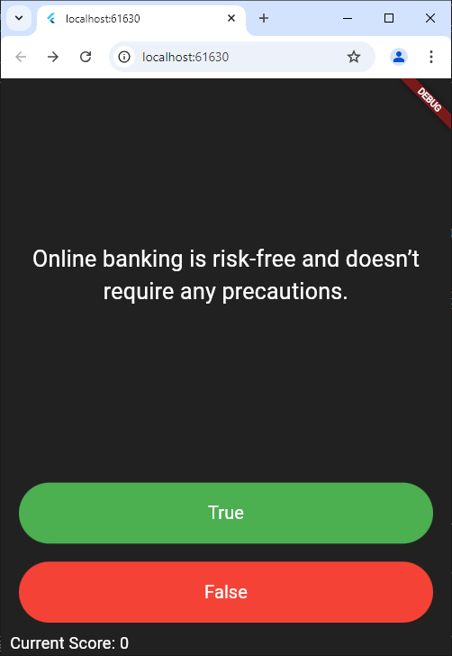
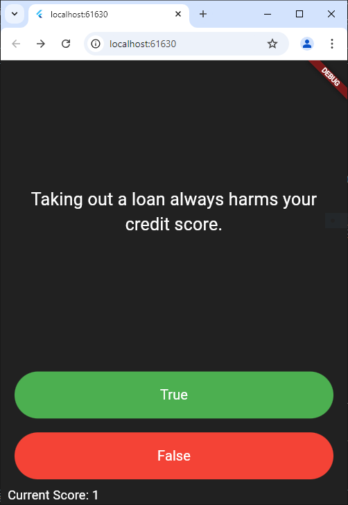

# FinTeenHere’s a sample `README.md` file for your project:

---

# **FinTeen**  
A **financial literacy app for teenagers** designed to make learning about finance engaging and interactive. FinTeen includes quizzes, challenges, and gamification features to encourage good financial habits in a fun and user-friendly way.

---

## **Features**
- **Interactive Quiz**:  
  Test your financial knowledge with true/false questions. Immediate feedback helps you learn as you go.  
- **Score Tracker**:  
  Keep track of your score as you progress through the quiz.  
- **Dynamic Feedback**:  
  See motivational messages for correct answers and explanations for incorrect ones.  
- **Goal-Based Challenges** *(Planned)*:  
  Set personal saving goals and complete challenges tailored to teenage scenarios like saving for a phone or concert tickets.  
- **Gamification** *(Planned)*:  
  Earn badges and rewards for completing challenges and maintaining good financial habits.

---

## **Technologies Used**
- **Frontend**: Flutter  
- **Language**: Dart  
- **Quiz Data Management**: Custom `QuizBank` class  

---

## **Getting Started**

### Prerequisites
- Install [Flutter](https://flutter.dev/docs/get-started/install) on your system.
- Ensure you have an IDE like [Android Studio](https://developer.android.com/studio) or [Visual Studio Code](https://code.visualstudio.com/).

### Installation
1. Clone the repository:  
   ```bash
   git clone https://github.com/your-username/FinTeen.git
   ```
2. Navigate to the project directory:  
   ```bash
   cd FinTeen
   ```
3. Install dependencies:  
   ```bash
   flutter pub get
   ```
4. Run the app on a connected device or emulator:  
   ```bash
   flutter run
   ```

---

## **Project Structure**
```
FinTeen/
├── lib/
│   ├── main.dart       # Entry point of the app
│   ├── quizbank.dart   # Quiz question data and logic
│   ├── new.dart        # Placeholder for additional features
├── pubspec.yaml        # Project dependencies and assets
└── README.md           # Project documentation
```

---

## **Future Enhancements**
- Add more quizzes and topics.
- Integrate a **budget tracker** for personal finance.
- Include **visual progress tracking** for savings goals.
- Enable **peer challenges** to promote financial habits in a social context.
- Add localization for multilingual support.

---

## **Contributing**
We welcome contributions! Follow these steps to contribute:  
1. Fork the repository.  
2. Create a new branch:  
   ```bash
   git checkout -b feature-name
   ```
3. Commit your changes:  
   ```bash
   git commit -m "Add feature-name"
   ```
4. Push to the branch:  
   ```bash
   git push origin feature-name
   ```
5. Open a pull request.
##Images




---

Feel free to replace placeholders like `your-username` and `your-email@example.com` with your actual details! Let me know if you want to include additional sections or changes.
